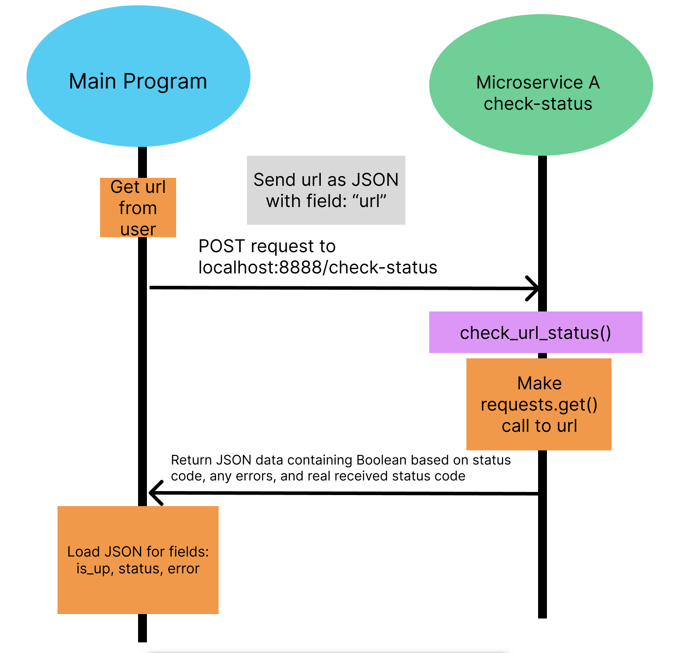

# Microservice A for Jason Stephens

Install the local requirements for this microservice with:

`pip install -r requirements.txt`

The dependencies are Flask, requests, & json.

## Communication Contract

### How to programmatically request data

However you get the URL of interest from the user, JSON-ify that to a key called "url" and send that as your payload in
a POST request to `http://localhost:8888/check-status`.

It could look something like:

```python
response_from_microservice = requests.post("http://localhost:8123/check-status", json={"url": "https://oregonstate.edu/"})
```

### How to programmatically receive data

The variable you create that is on the left hand side of your `requests.post()` call will hold the response that this
microservice sends back. You should cast that response to JSON either using the requests library or the `json` builtin from Python.

My microservice will send back three fields in that JSON response:

1. status -- the returned status of the url that was tested
2. is_up -- the Boolean value indicating if the website is active
3. error -- An optional error message if any were encountered trying to assert the web page status.

It could look something like:

```python
response_from_microservice.json()
is_up = res.get("is_up", False)
# Whatever you do with Boolean value `is_up` following this
```

### UML sequence diagram


